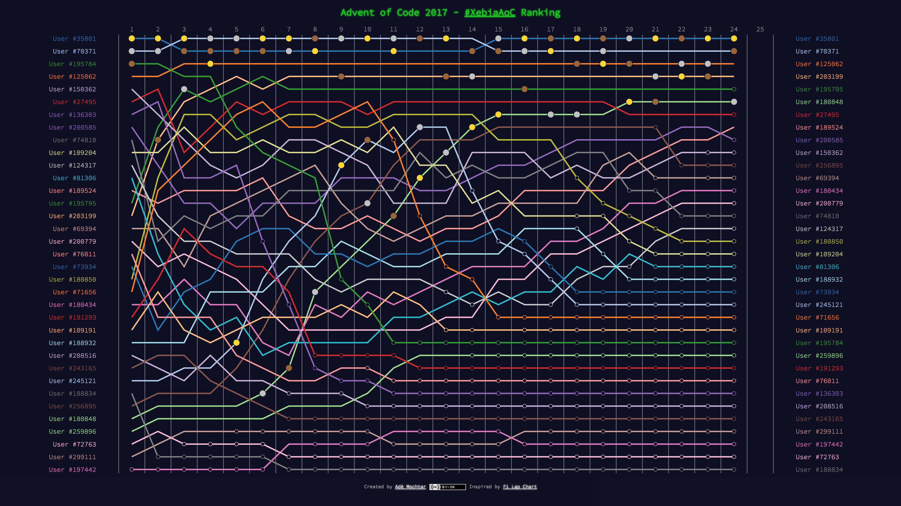

# Advent of Code private leaderboard ranking

Visualize the ranking over time of an [Advent of Code](https://www.adventofcode.com/) private leaderboard. See https://amochtar.github.io/aoc-ranking/ for an interactive example of the [#XebiaAoC](https://xebia.com/community/advent-of-code) private leaderboard.

## Usage

1. Download the JSON for your private leaderboard

        SESSION=<value from session cookie>
        LEADERBOARD=<private leaderboard id>
        curl --cookie "session=${SESSION}" http://adventofcode.com/2017/leaderboard/private/view/${LEADERBOARD}.json > data/leaderboard.json

2. Transform the leaderboard json to ranking data, and save as `ranking.json`

        cat data/leaderboard.json | ./bin/private-leaderboard-to-ranking.py > data/ranking.json

3. Start local webserver

        python -m http.server

4. Open browser and load ranking: http://localhost:8000/index.html

## Requirements

* Python 3
